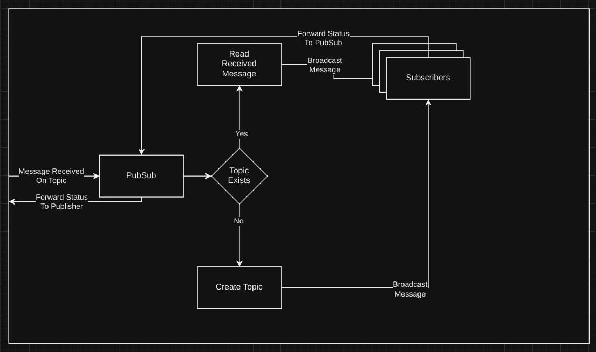
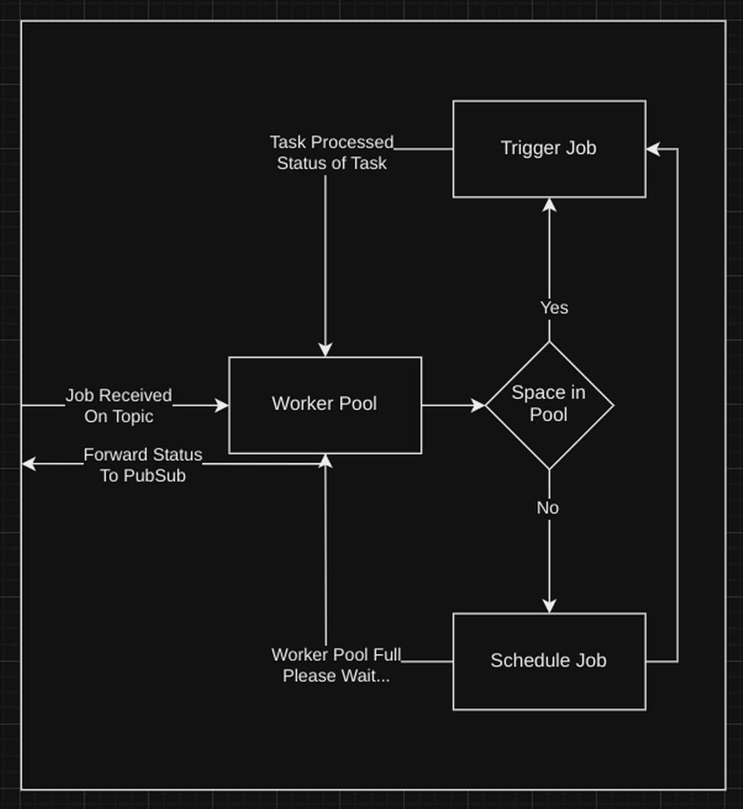
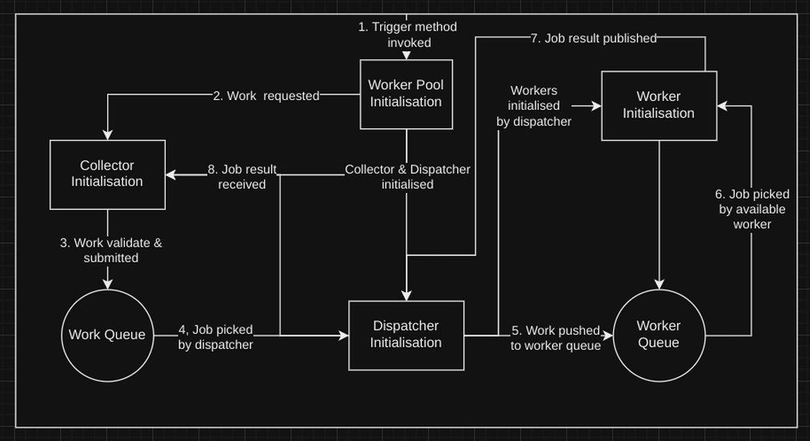

# utilities

This repository contains common libraries for my projects.

This repository provides the following packages:

- [Data](#data)
- [Database](#database)
- [Logger](#logger)
- [Network](#network)
- [Security](#security)
- [PubSub](#pubsub)
- [Worker](#worker)

## Data

## Logger

```
type Logger interface {
	Info(string, ...interface{})
	Warn(string, ...interface{})
	Error(error, ...interface{})
	Fatal(error, ...interface{})
	Debug(string, ...interface{})
	With(key string, args ...interface{})
}
```

## Database

```
type Database interface {
	Operations
	Transactions
	Closer
	Configure
}

type Operations interface {
	Create(context.Context, ...interface{}) (models.Response, error)
	Query(context.Context, ...interface{}) (models.Response, error)
	Update(context.Context, ...interface{}) (models.Response, error)
	Delete(context.Context, ...interface{}) (models.Response, error)
}

type Transactions interface {
	Begin(context.Context, ...interface{}) (models.Response, error)
	Execute(context.Context, ...interface{}) (models.Response, error)
	Rollback(context.Context, ...interface{}) (models.Response, error)
}

type Closer interface {
	Close() error
}

type Configure interface {
	Configure(context.Context, ...interface{}) error
}
```

## Network

## Security

## PubSub

<P style="text-align:center;">*PubSub System*</p>

## Worker

This package provides the following interface:

```go
package worker

type Pool interface {
	Execute(func(...interface{}) []interface{}) error
	Exit()
}

```

### Workflow

<p style="text-align:center;">
<p style="text-align:center;">*Worker Pool Workflow*</p>

- At worker pool initialization:
    - Collector & work queue are initialized
    - Dispatcher & worker queue are initialized
        - New workers are initialized with id, and each worker is registered in worker queue

- Each time `Execute(func(...interface{}) []interface{}) error` method is called:
    - Collector validates work request
    - Adds work to the work channel with if space available
    - Dispatcher listens on the work channel
    - If work is available, wait for worker to be available
    - Once a worker is available, pushes work to the worker channel, removes the worker from the worker channel

- Each time a Worker completes a work:
    - Adds itself back to the worker queue
    - Signal received on the work channel, execute
    - Signal received on the exit channel, exit

